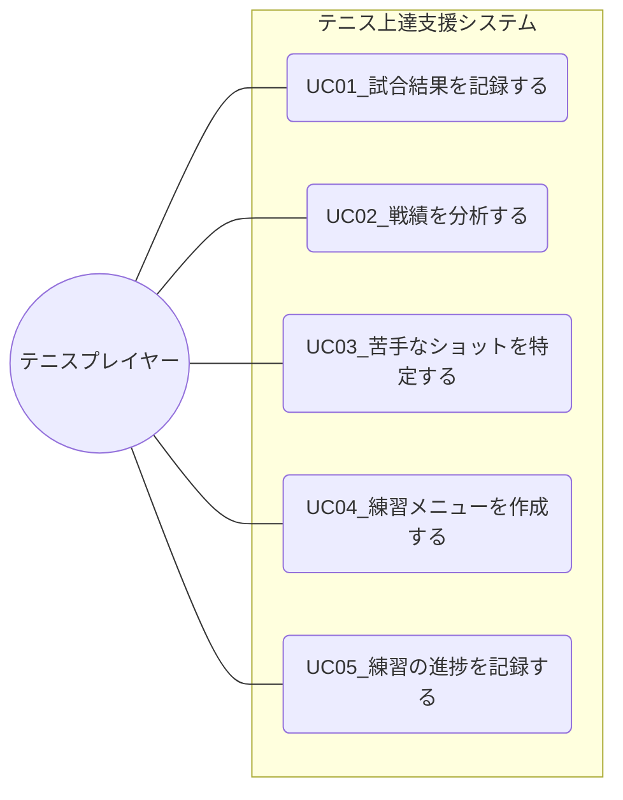

```mermaid
graph LR
    User((テニスプレイヤー))

    subgraph テニス上達支援システム
        %% 記録フェーズ
        UC01(UC01_試合結果を記録する)
        
        %% 分析・課題抽出フェーズ
        UC02(UC02_戦績を分析する)
        UC03(UC03_苦手なショットを特定する)
        
        %% 練習フェーズ
        UC04(UC04_練習メニューを作成する)
        UC05(UC05_練習の進捗を記録する)
    end

    %% ユーザーと機能の紐付け
    User --- UC01
    User --- UC02
    User --- UC03
    User --- UC04
    User --- UC05
```
